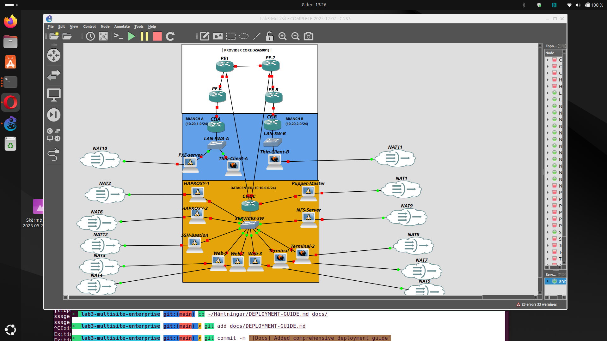

# Deployment Guide - Lab 3 Multi-Site Enterprise Network

Grupp 2 SN24 | December 2025

---

## Innehåll
1. [Förutsättningar](#förutsättningar)
2. [GNS3 Topologi](#gns3-topologi)
3. [Steg 1: Provider Core](#steg-1-provider-core)
4. [Steg 2: Datacenter](#steg-2-datacenter)
5. [Steg 3: DC-servrar](#steg-3-dc-servrar)
6. [Steg 4: Branch A](#steg-4-branch-a)
7. [Steg 5: Branch B](#steg-5-branch-b)
8. [Verifiering](#verifiering)

---

## Förutsättningar

Innan du börjar, se till att du har:

- GNS3 installerat (vi kör version 2.2.x)
- Cisco IOSv image (vi använder 15.9)
- Debian 12 QEMU image
- AlmaLinux 9.4 QEMU image (för terminal-servrar)
- Windows 10 image (valfritt, för Branch B)
- Minst 32GB RAM (det här är resurskrävande!)

**Tips:** Spara ofta! GNS3 kan krascha ibland, speciellt med många VMs igång.

---

## GNS3 Topologi

### Översikt





### Enheter att skapa i GNS3

| Enhet | Typ | Image |
|-------|-----|-------|
| PE1, PE-2, PE-A, PE-B | Router | Cisco IOSv |
| CE-DC, CE-A, CE-B | Router | Cisco IOSv |
| SERVICES-SW, LAN-SW-A, LAN-SW-B | Switch | Ethernet switch |
| HAProxy-1, HAProxy-2 | VM | Debian 12 |
| Web-1, Web-2, Web-3 | VM | Debian 12 |
| Terminal-1, Terminal-2 | VM | AlmaLinux 9.4 |
| NFS-Server | VM | Debian 12 |
| SSH-Bastion | VM | Debian 12 |
| Puppet-Master | VM | Debian 12 |
| PXE-Server | VM | Debian 12 |
| Thin-Client | VM | Debian 12 (PXE boot) |
| Windows-Client | VM | Windows 10 (valfritt) |

### NAT-moln

Varje server behöver internet-access för att installera paket. Koppla varje VM till en NAT-moln via ens5 (andra nätverkskortet).

---

## Steg 1: Provider Core

Provider core är "internet-leverantören" som kopplar ihop alla sites. Alla PE-routrar kör iBGP sinsemellan.

### 1.1 Skapa routrar och koppla ihop

**Kopplingar:**
```
PE1 Gi0/1 ↔ PE-2 Gi0/1     (10.255.0.0/30)
PE1 Gi0/2 ↔ PE-A Gi0/1     (10.255.0.4/30)
PE-2 Gi0/2 ↔ PE-B Gi0/1    (10.255.0.8/30)
```

### 1.2 Konfigurera PE1

Öppna konsol till PE1 och klistra in:

```
enable
conf t

hostname PE1

bfd slow-timers 2000

interface Loopback0
 ip address 2.2.2.1 255.255.255.255

interface GigabitEthernet0/0
 description Link to CE-DC
 ip address 192.168.100.2 255.255.255.252
 bfd interval 300 min_rx 300 multiplier 3
 no shutdown

interface GigabitEthernet0/1
 description Link to PE-2
 ip address 10.255.0.1 255.255.255.252
 no shutdown

interface GigabitEthernet0/2
 description Link to PE-A
 ip address 10.255.0.5 255.255.255.252
 no shutdown

router ospf 1
 router-id 2.2.2.1
 network 2.2.2.1 0.0.0.0 area 0
 network 10.255.0.0 0.0.0.3 area 0
 network 10.255.0.4 0.0.0.3 area 0

router bgp 65001
 bgp router-id 2.2.2.1
 bgp log-neighbor-changes
 neighbor 2.2.2.2 remote-as 65001
 neighbor 2.2.2.2 update-source Loopback0
 neighbor 2.2.2.10 remote-as 65001
 neighbor 2.2.2.10 update-source Loopback0
 neighbor 2.2.2.11 remote-as 65001
 neighbor 2.2.2.11 update-source Loopback0
 neighbor 192.168.100.1 remote-as 65000
 neighbor 192.168.100.1 description CE-DC
 neighbor 192.168.100.1 fall-over bfd
 address-family ipv4
  neighbor 2.2.2.2 activate
  neighbor 2.2.2.2 next-hop-self
  neighbor 2.2.2.10 activate
  neighbor 2.2.2.10 next-hop-self
  neighbor 2.2.2.11 activate
  neighbor 2.2.2.11 next-hop-self
  neighbor 192.168.100.1 activate
  neighbor 192.168.100.1 prefix-list FROM-DC in
  neighbor 192.168.100.1 maximum-prefix 20 80 warning-only
 exit-address-family

ip prefix-list FROM-DC seq 10 permit 10.0.0.0/24
ip prefix-list FROM-DC seq 20 permit 10.10.0.0/24
ip prefix-list FROM-DC seq 30 permit 10.20.0.0/24
ip prefix-list FROM-DC seq 1000 deny 0.0.0.0/0 le 32

end
write memory
```

### 1.3 Konfigurera PE-2

```
enable
conf t

hostname PE-2

bfd slow-timers 2000

interface Loopback0
 ip address 2.2.2.2 255.255.255.255

interface GigabitEthernet0/0
 description Link to CE-DC
 ip address 192.168.100.6 255.255.255.252
 bfd interval 300 min_rx 300 multiplier 3
 no shutdown

interface GigabitEthernet0/1
 description Link to PE1
 ip address 10.255.0.2 255.255.255.252
 no shutdown

interface GigabitEthernet0/2
 description Link to PE-B
 ip address 10.255.0.9 255.255.255.252
 no shutdown

router ospf 1
 router-id 2.2.2.2
 network 2.2.2.2 0.0.0.0 area 0
 network 10.255.0.0 0.0.0.3 area 0
 network 10.255.0.8 0.0.0.3 area 0

router bgp 65001
 bgp router-id 2.2.2.2
 bgp log-neighbor-changes
 neighbor 2.2.2.1 remote-as 65001
 neighbor 2.2.2.1 update-source Loopback0
 neighbor 2.2.2.10 remote-as 65001
 neighbor 2.2.2.10 update-source Loopback0
 neighbor 2.2.2.11 remote-as 65001
 neighbor 2.2.2.11 update-source Loopback0
 neighbor 192.168.100.5 remote-as 65000
 neighbor 192.168.100.5 description CE-DC
 neighbor 192.168.100.5 fall-over bfd
 address-family ipv4
  neighbor 2.2.2.1 activate
  neighbor 2.2.2.1 next-hop-self
  neighbor 2.2.2.10 activate
  neighbor 2.2.2.10 next-hop-self
  neighbor 2.2.2.11 activate
  neighbor 2.2.2.11 next-hop-self
  neighbor 192.168.100.5 activate
  neighbor 192.168.100.5 prefix-list FROM-DC in
  neighbor 192.168.100.5 maximum-prefix 20 80 warning-only
 exit-address-family

ip prefix-list FROM-DC seq 10 permit 10.0.0.0/24
ip prefix-list FROM-DC seq 20 permit 10.10.0.0/24
ip prefix-list FROM-DC seq 30 permit 10.20.0.0/24
ip prefix-list FROM-DC seq 1000 deny 0.0.0.0/0 le 32

end
write memory
```

### 1.4 Konfigurera PE-A

```
enable
conf t

hostname PE-A

bfd slow-timers 2000

interface Loopback0
 ip address 2.2.2.10 255.255.255.255

interface GigabitEthernet0/0
 description Link to CE-A
 ip address 192.168.101.2 255.255.255.252
 bfd interval 300 min_rx 300 multiplier 3
 no shutdown

interface GigabitEthernet0/1
 description Link to PE1
 ip address 10.255.0.6 255.255.255.252
 no shutdown

router ospf 1
 router-id 2.2.2.10
 network 2.2.2.10 0.0.0.0 area 0
 network 10.255.0.4 0.0.0.3 area 0

router bgp 65001
 bgp router-id 2.2.2.10
 bgp log-neighbor-changes
 neighbor 2.2.2.1 remote-as 65001
 neighbor 2.2.2.1 update-source Loopback0
 neighbor 2.2.2.2 remote-as 65001
 neighbor 2.2.2.2 update-source Loopback0
 neighbor 2.2.2.11 remote-as 65001
 neighbor 2.2.2.11 update-source Loopback0
 neighbor 192.168.101.1 remote-as 65000
 neighbor 192.168.101.1 description CE-A
 neighbor 192.168.101.1 fall-over bfd
 address-family ipv4
  redistribute connected
  neighbor 2.2.2.1 activate
  neighbor 2.2.2.1 next-hop-self
  neighbor 2.2.2.2 activate
  neighbor 2.2.2.2 next-hop-self
  neighbor 2.2.2.11 activate
  neighbor 2.2.2.11 next-hop-self
  neighbor 192.168.101.1 activate
  neighbor 192.168.101.1 prefix-list FROM-BRANCH-A in
  neighbor 192.168.101.1 maximum-prefix 10 80 warning-only
 exit-address-family

ip prefix-list FROM-BRANCH-A seq 10 permit 10.0.1.0/24
ip prefix-list FROM-BRANCH-A seq 20 permit 10.20.1.0/24
ip prefix-list FROM-BRANCH-A seq 1000 deny 0.0.0.0/0 le 32

end
write memory
```

### 1.5 Konfigurera PE-B

```
enable
conf t

hostname PE-B

bfd slow-timers 2000

interface Loopback0
 ip address 2.2.2.11 255.255.255.255

interface GigabitEthernet0/0
 description Link to CE-B
 ip address 192.168.102.2 255.255.255.252
 bfd interval 300 min_rx 300 multiplier 3
 no shutdown

interface GigabitEthernet0/1
 description Link to PE-2
 ip address 10.255.0.10 255.255.255.252
 no shutdown

router ospf 1
 router-id 2.2.2.11
 network 2.2.2.11 0.0.0.0 area 0
 network 10.255.0.8 0.0.0.3 area 0

router bgp 65001
 bgp router-id 2.2.2.11
 bgp log-neighbor-changes
 neighbor 2.2.2.1 remote-as 65001
 neighbor 2.2.2.1 update-source Loopback0
 neighbor 2.2.2.2 remote-as 65001
 neighbor 2.2.2.2 update-source Loopback0
 neighbor 2.2.2.10 remote-as 65001
 neighbor 2.2.2.10 update-source Loopback0
 neighbor 192.168.102.1 remote-as 65000
 neighbor 192.168.102.1 description CE-B
 neighbor 192.168.102.1 fall-over bfd
 address-family ipv4
  neighbor 2.2.2.1 activate
  neighbor 2.2.2.1 next-hop-self
  neighbor 2.2.2.2 activate
  neighbor 2.2.2.2 next-hop-self
  neighbor 2.2.2.10 activate
  neighbor 2.2.2.10 next-hop-self
  neighbor 192.168.102.1 activate
  neighbor 192.168.102.1 prefix-list FROM-BRANCH-B in
  neighbor 192.168.102.1 maximum-prefix 10 80 warning-only
 exit-address-family

ip prefix-list FROM-BRANCH-B seq 10 permit 10.0.2.0/24
ip prefix-list FROM-BRANCH-B seq 20 permit 10.20.2.0/24
ip prefix-list FROM-BRANCH-B seq 1000 deny 0.0.0.0/0 le 32

end
write memory
```

### 1.6 Verifiera Provider Core

Vänta någon minut så OSPF och BGP hinner konvergera, sedan:

```
show ip ospf neighbor
show ip bgp summary
```

Alla iBGP-sessioner ska vara "Established".

---

## Steg 2: Datacenter

CE-DC är hjärtat i nätverket. Den är dual-homed till både PE1 och PE2.

### 2.1 Kopplingar

```
CE-DC Gi0/0 ↔ SERVICES-SW          (10.10.0.1/24)
CE-DC Gi0/1 ↔ PE1 Gi0/0            (192.168.100.0/30)
CE-DC Gi0/2 ↔ PE-2 Gi0/0           (192.168.100.4/30)
CE-DC Gi0/3 ↔ (MGMT - ej använd)   (10.0.0.1/24)
```

### 2.2 Konfigurera CE-DC

Det här är den längsta konfigurationen. Ta det lugnt och klistra in steg för steg.

```
enable
conf t

hostname CE-DC

vrf definition MGMT
 rd 65000:1
 address-family ipv4
 exit-address-family

vrf definition SERVICES
 rd 65000:2
 address-family ipv4
 exit-address-family

vrf definition USER
 rd 65000:3
 address-family ipv4
 exit-address-family

interface Loopback0
 ip address 1.1.1.1 255.255.255.255

interface GigabitEthernet0/0
 description SERVICES VRF Gateway
 ip address 10.10.0.1 255.255.255.0
 ip flow ingress
 ip flow egress
 no shutdown

interface GigabitEthernet0/1
 description Link to PE1
 ip address 192.168.100.1 255.255.255.252
 bfd interval 300 min_rx 300 multiplier 3
 ip flow ingress
 ip flow egress
 no shutdown

interface GigabitEthernet0/2
 description Link to PE2
 ip address 192.168.100.5 255.255.255.252
 bfd interval 300 min_rx 300 multiplier 3
 ip flow ingress
 ip flow egress
 no shutdown

interface GigabitEthernet0/3
 description MGMT VRF
 vrf forwarding MGMT
 ip address 10.0.0.1 255.255.255.0
 no shutdown

! NetFlow
ip flow-export version 9
ip flow-export destination 10.10.0.10 2055
ip flow-export source Loopback0

! BGP Prefix-lists
ip prefix-list DC-OUT seq 10 permit 10.0.0.0/24
ip prefix-list DC-OUT seq 20 permit 10.10.0.0/24
ip prefix-list DC-OUT seq 30 permit 10.20.0.0/24
ip prefix-list DC-OUT seq 1000 deny 0.0.0.0/0 le 32

ip prefix-list DC-IN seq 10 permit 10.0.1.0/24
ip prefix-list DC-IN seq 20 permit 10.0.2.0/24
ip prefix-list DC-IN seq 30 permit 10.20.1.0/24
ip prefix-list DC-IN seq 40 permit 10.20.2.0/24
ip prefix-list DC-IN seq 50 permit 2.2.2.0/24 le 32
ip prefix-list DC-IN seq 60 permit 10.255.0.0/16 le 30
ip prefix-list DC-IN seq 70 permit 192.168.101.0/24 le 30
ip prefix-list DC-IN seq 80 permit 192.168.102.0/24 le 30
ip prefix-list DC-IN seq 1000 deny 0.0.0.0/0 le 32

! Traffic Engineering
route-map SET-COMMUNITY-PE1 permit 10
 set community 65000:110

route-map SET-COMMUNITY-PE2 permit 10
 set community 65000:120

route-map PREFER-PE1 permit 10
 set local-preference 150

route-map PREFER-PE2 permit 10
 set local-preference 100

! BFD
bfd slow-timers 2000

router bgp 65000
 bgp router-id 1.1.1.1
 bgp log-neighbor-changes
 neighbor 192.168.100.2 remote-as 65001
 neighbor 192.168.100.2 description PE1
 neighbor 192.168.100.2 fall-over bfd
 neighbor 192.168.100.6 remote-as 65001
 neighbor 192.168.100.6 description PE2
 neighbor 192.168.100.6 fall-over bfd
 address-family ipv4
  network 10.0.0.0 mask 255.255.255.0
  network 10.10.0.0 mask 255.255.255.0
  network 10.20.0.0 mask 255.255.255.0
  redistribute connected
  neighbor 192.168.100.2 activate
  neighbor 192.168.100.2 send-community
  neighbor 192.168.100.2 allowas-in 2
  neighbor 192.168.100.2 prefix-list DC-IN in
  neighbor 192.168.100.2 prefix-list DC-OUT out
  neighbor 192.168.100.2 route-map PREFER-PE1 in
  neighbor 192.168.100.2 route-map SET-COMMUNITY-PE1 out
  neighbor 192.168.100.2 maximum-prefix 50 80 warning-only
  neighbor 192.168.100.6 activate
  neighbor 192.168.100.6 send-community
  neighbor 192.168.100.6 allowas-in 2
  neighbor 192.168.100.6 prefix-list DC-IN in
  neighbor 192.168.100.6 prefix-list DC-OUT out
  neighbor 192.168.100.6 route-map PREFER-PE2 in
  neighbor 192.168.100.6 route-map SET-COMMUNITY-PE2 out
  neighbor 192.168.100.6 maximum-prefix 50 80 warning-only
 exit-address-family
 address-family ipv4 vrf MGMT
  redistribute connected
 exit-address-family

! Static routes
ip route 2.2.2.0 255.255.255.0 192.168.100.2
ip route 2.2.2.0 255.255.255.0 192.168.100.6 10
ip route 10.0.0.0 255.255.255.0 Null0
ip route 10.20.0.0 255.255.255.0 Null0
ip route 10.255.0.0 255.255.0.0 192.168.100.2
ip route 10.255.0.0 255.255.0.0 192.168.100.6 10
ip route 192.168.101.0 255.255.255.0 192.168.100.2
ip route 192.168.101.0 255.255.255.0 192.168.100.6 10
ip route 192.168.102.0 255.255.255.0 192.168.100.2
ip route 192.168.102.0 255.255.255.0 192.168.100.6 10

! SNMPv3
snmp-server group LAB3-RO v3 priv read LAB3-VIEW access 99
snmp-server view LAB3-VIEW iso included
snmp-server user snmpuser LAB3-RO v3 auth sha Lab3SNMPauth! priv aes 128 Lab3SNMPpriv!
snmp-server location "Datacenter DC - Grupp2 SN24"
snmp-server contact "admin@grupp2.lab3.local"

access-list 99 permit 10.0.0.0 0.0.0.255

! Syslog
logging source-interface Loopback0
logging host 10.0.0.10 vrf MGMT

end
write memory
```

### 2.3 Verifiera CE-DC

```
show ip bgp summary
```

Du ska se två sessioner (PE1 och PE2), båda "Established".

**OBS! Viktigt:** `allowas-in 2` är nödvändigt! Utan detta blockeras routes från branches eftersom de har samma AS-nummer (65000).

---

## Steg 3: DC-servrar

Nu ska vi sätta upp alla servrar i DC. Alla kopplas till SERVICES-SW.

### IP-adresser

| Server | IP | Gateway |
|--------|-----|---------|
| HAProxy-1 | 10.10.0.10 | 10.10.0.1 |
| HAProxy-2 | 10.10.0.11 | 10.10.0.1 |
| VIP (VRRP) | 10.10.0.9 | - |
| Web-1 | 10.10.0.21 | 10.10.0.1 |
| Web-2 | 10.10.0.22 | 10.10.0.1 |
| Web-3 | 10.10.0.23 | 10.10.0.1 |
| Terminal-1 | 10.10.0.31 | 10.10.0.1 |
| Terminal-2 | 10.10.0.32 | 10.10.0.1 |
| NFS-Server | 10.10.0.40 | 10.10.0.1 |
| SSH-Bastion | 10.10.0.50 | 10.10.0.1 |
| Puppet-Master | 10.0.0.10 | 10.0.0.1 |

### 3.1 HAProxy-1

Starta VM:en och logga in. Kör följande som root:

```bash
# Sätt hostname
hostnamectl set-hostname haproxy-1

# Konfigurera nätverk
cat > /etc/network/interfaces << 'EOF'
auto lo
iface lo inet loopback

auto ens4
iface ens4 inet static
    address 10.10.0.10
    netmask 255.255.255.0
    up ip route add 10.20.1.0/24 via 10.10.0.1
    up ip route add 10.20.2.0/24 via 10.10.0.1
    up ip route add 10.0.0.0/24 via 10.10.0.1

auto ens5
iface ens5 inet dhcp
EOF

# Starta om nätverket
systemctl restart networking

# Installera HAProxy och keepalived
apt update
apt install -y haproxy keepalived

# HAProxy config
cat > /etc/haproxy/haproxy.cfg << 'EOF'
global
    log /dev/log local0
    maxconn 4096
    user haproxy
    group haproxy
    daemon

defaults
    log     global
    mode    http
    option  httplog
    option  dontlognull
    timeout connect 5000
    timeout client  50000
    timeout server  50000

frontend web_frontend
    bind *:80
    default_backend web_backend

backend web_backend
    balance roundrobin
    option httpchk GET /
    server web1 10.10.0.21:80 check
    server web2 10.10.0.22:80 check
    server web3 10.10.0.23:80 check
EOF

# Keepalived config (MASTER)
cat > /etc/keepalived/keepalived.conf << 'EOF'
vrrp_instance VI_1 {
    state MASTER
    interface ens4
    virtual_router_id 51
    priority 100
    advert_int 1
    authentication {
        auth_type PASS
        auth_pass lab3secret
    }
    virtual_ipaddress {
        10.10.0.9/24
    }
}
EOF

# Starta tjänster
systemctl enable haproxy keepalived
systemctl restart haproxy keepalived
```

### 3.2 HAProxy-2

Samma som HAProxy-1, men med några skillnader:

```bash
hostnamectl set-hostname haproxy-2

# Nätverk - ändra IP till .11
cat > /etc/network/interfaces << 'EOF'
auto lo
iface lo inet loopback

auto ens4
iface ens4 inet static
    address 10.10.0.11
    netmask 255.255.255.0
    up ip route add 10.20.1.0/24 via 10.10.0.1
    up ip route add 10.20.2.0/24 via 10.10.0.1
    up ip route add 10.0.0.0/24 via 10.10.0.1

auto ens5
iface ens5 inet dhcp
EOF

systemctl restart networking

apt update
apt install -y haproxy keepalived

# Samma HAProxy config som HAProxy-1
cat > /etc/haproxy/haproxy.cfg << 'EOF'
global
    log /dev/log local0
    maxconn 4096
    user haproxy
    group haproxy
    daemon

defaults
    log     global
    mode    http
    option  httplog
    option  dontlognull
    timeout connect 5000
    timeout client  50000
    timeout server  50000

frontend web_frontend
    bind *:80
    default_backend web_backend

backend web_backend
    balance roundrobin
    option httpchk GET /
    server web1 10.10.0.21:80 check
    server web2 10.10.0.22:80 check
    server web3 10.10.0.23:80 check
EOF

# Keepalived config (BACKUP - priority 90!)
cat > /etc/keepalived/keepalived.conf << 'EOF'
vrrp_instance VI_1 {
    state BACKUP
    interface ens4
    virtual_router_id 51
    priority 90
    advert_int 1
    authentication {
        auth_type PASS
        auth_pass lab3secret
    }
    virtual_ipaddress {
        10.10.0.9/24
    }
}
EOF

systemctl enable haproxy keepalived
systemctl restart haproxy keepalived
```

### 3.3 Web-servrar (Web-1, Web-2, Web-3)

Kör på varje webbserver (ändra IP och hostname):

**Web-1:**
```bash
hostnamectl set-hostname web-1

cat > /etc/network/interfaces << 'EOF'
auto lo
iface lo inet loopback

auto ens4
iface ens4 inet static
    address 10.10.0.21
    netmask 255.255.255.0
    up ip route add 10.20.1.0/24 via 10.10.0.1
    up ip route add 10.20.2.0/24 via 10.10.0.1
    up ip route add 10.0.0.0/24 via 10.10.0.1

auto ens5
iface ens5 inet dhcp
EOF

systemctl restart networking

apt update
apt install -y apache2

echo '<h1>Lab 3 - Server: web-1</h1><p>IP: 10.10.0.21</p><p>Served via HAProxy</p>' > /var/www/html/index.html

systemctl enable apache2
systemctl start apache2
```

**Web-2 och Web-3:** Samma sak, bara ändra hostname och IP (10.10.0.22, 10.10.0.23).

### 3.4 Terminal-servrar (AlmaLinux)

Terminal-servrarna kör AlmaLinux för variation (och för att visa att Puppet funkar med olika OS).

**Terminal-1:**
```bash
hostnamectl set-hostname terminal-1

# Konfigurera nätverk med nmcli
nmcli con add type ethernet con-name "services" ifname eth0 ipv4.addresses 10.10.0.31/24 ipv4.method manual autoconnect yes
nmcli con mod "services" +ipv4.routes "10.20.1.0/24 10.10.0.1, 10.20.2.0/24 10.10.0.1, 10.0.0.0/24 10.10.0.1"
nmcli con up "services"

# Installera XRDP
dnf install -y epel-release
dnf install -y xrdp xorg-x11-server-Xorg
systemctl enable xrdp
systemctl start xrdp

# Öppna brandvägg
firewall-cmd --permanent --add-port=3389/tcp
firewall-cmd --reload

# Skapa användare
useradd -m labuser
echo "labpass123" | passwd --stdin labuser
```

**Terminal-2:** Samma sak, ändra IP till 10.10.0.32.

### 3.5 NFS-Server

```bash
hostnamectl set-hostname nfs-server

cat > /etc/network/interfaces << 'EOF'
auto lo
iface lo inet loopback

auto ens4
iface ens4 inet static
    address 10.10.0.40
    netmask 255.255.255.0
    up ip route add 10.20.1.0/24 via 10.10.0.1
    up ip route add 10.20.2.0/24 via 10.10.0.1
    up ip route add 10.0.0.0/24 via 10.10.0.1

auto ens5
iface ens5 inet dhcp
EOF

systemctl restart networking

apt update
apt install -y nfs-kernel-server

mkdir -p /srv/nfs/home
chmod 777 /srv/nfs/home

echo '/srv/nfs/home   10.10.0.0/24(rw,sync,no_subtree_check,no_root_squash)' > /etc/exports

systemctl enable nfs-kernel-server
systemctl restart nfs-kernel-server
exportfs -ra
```

### 3.6 SSH-Bastion (med MFA)

```bash
hostnamectl set-hostname ssh-bastion

cat > /etc/network/interfaces << 'EOF'
auto lo
iface lo inet loopback

auto ens4
iface ens4 inet static
    address 10.10.0.50
    netmask 255.255.255.0
    gateway 10.10.0.1
    up ip route add 10.20.1.0/24 via 10.10.0.1
    up ip route add 10.20.2.0/24 via 10.10.0.1
    up ip route add 10.0.0.0/24 via 10.10.0.1

auto ens5
iface ens5 inet dhcp
EOF

systemctl restart networking

apt update
apt install -y openssh-server libpam-google-authenticator

# Skapa användare
useradd -m -s /bin/bash anton
echo "anton:SecurePass123!" | chpasswd

# Konfigurera MFA för anton
su - anton -c "google-authenticator -t -d -f -r 3 -R 30 -w 3"

# Aktivera MFA i PAM
echo "auth required pam_google_authenticator.so" >> /etc/pam.d/sshd
sed -i 's/KbdInteractiveAuthentication no/KbdInteractiveAuthentication yes/' /etc/ssh/sshd_config

systemctl restart sshd
```

---

## Steg 4: Branch A

### 4.1 Kopplingar

```
CE-A Gi0/0 ↔ PE-A Gi0/0        (192.168.101.0/30)
CE-A Gi0/2 ↔ LAN-SW-A          (10.20.1.1/24)
LAN-SW-A ↔ PXE-Server, Thin-Client
```

### 4.2 Konfigurera CE-A

```
enable
conf t

hostname CE-A

vrf definition MGMT
 rd 65000:10
 address-family ipv4
 exit-address-family

vrf definition USER
 rd 65000:30
 address-family ipv4
 exit-address-family

interface Loopback0
 ip address 1.1.1.10 255.255.255.255

interface GigabitEthernet0/0
 description Link to PE-A
 ip address 192.168.101.1 255.255.255.252
 bfd interval 300 min_rx 300 multiplier 3
 ip flow ingress
 ip flow egress
 no shutdown

interface GigabitEthernet0/1
 description MGMT VRF
 vrf forwarding MGMT
 ip address 10.0.1.1 255.255.255.0
 no shutdown

interface GigabitEthernet0/2
 description USER VRF - LAN
 ip address 10.20.1.1 255.255.255.0
 ip flow ingress
 ip flow egress
 no shutdown

ip flow-export version 9
ip flow-export destination 10.10.0.10 2055
ip flow-export source Loopback0

ip prefix-list BRANCH-A-OUT seq 10 permit 10.0.1.0/24
ip prefix-list BRANCH-A-OUT seq 20 permit 10.20.1.0/24
ip prefix-list BRANCH-A-OUT seq 1000 deny 0.0.0.0/0 le 32

ip prefix-list BRANCH-A-IN seq 10 permit 10.0.0.0/24
ip prefix-list BRANCH-A-IN seq 20 permit 10.0.2.0/24
ip prefix-list BRANCH-A-IN seq 30 permit 10.10.0.0/24
ip prefix-list BRANCH-A-IN seq 40 permit 10.20.0.0/24
ip prefix-list BRANCH-A-IN seq 50 permit 10.20.2.0/24
ip prefix-list BRANCH-A-IN seq 60 permit 2.2.2.0/24 le 32
ip prefix-list BRANCH-A-IN seq 1000 deny 0.0.0.0/0 le 32

bfd slow-timers 2000

router bgp 65000
 bgp router-id 1.1.1.10
 bgp log-neighbor-changes
 neighbor 192.168.101.2 remote-as 65001
 neighbor 192.168.101.2 description PE-A
 neighbor 192.168.101.2 fall-over bfd
 address-family ipv4
  network 10.0.1.0 mask 255.255.255.0
  network 10.20.1.0 mask 255.255.255.0
  neighbor 192.168.101.2 activate
  neighbor 192.168.101.2 allowas-in 2
  neighbor 192.168.101.2 prefix-list BRANCH-A-IN in
  neighbor 192.168.101.2 prefix-list BRANCH-A-OUT out
  neighbor 192.168.101.2 maximum-prefix 50 80 warning-only
 exit-address-family

ip route 10.0.1.0 255.255.255.0 Null0
ip route 10.20.1.0 255.255.255.0 Null0

snmp-server group LAB3-RO v3 priv read LAB3-VIEW access 99
snmp-server view LAB3-VIEW iso included
snmp-server user snmpuser LAB3-RO v3 auth sha Lab3SNMPauth! priv aes 128 Lab3SNMPpriv!
snmp-server location "Branch A - Grupp2 SN24"
snmp-server contact "admin@grupp2.lab3.local"

access-list 99 permit 10.0.0.0 0.0.0.255
access-list 99 permit 10.0.1.0 0.0.0.255

end
write memory
```

### 4.3 PXE-Server (Branch A)

PXE-servern tillhandahåller DHCP, TFTP och preseed för automatisk installation av thin clients.

```bash
hostnamectl set-hostname pxe-server

cat > /etc/network/interfaces << 'EOF'
auto lo
iface lo inet loopback

auto ens4
iface ens4 inet static
    address 10.20.1.10
    netmask 255.255.255.0
    gateway 10.20.1.1

auto ens5
iface ens5 inet dhcp
EOF

systemctl restart networking

apt update
apt install -y isc-dhcp-server tftpd-hpa apache2 pxelinux syslinux-common

# DHCP config
cat > /etc/dhcp/dhcpd.conf << 'EOF'
option domain-name "branch-a.lab3.local";
option domain-name-servers 8.8.8.8, 8.8.4.4;
default-lease-time 600;
max-lease-time 7200;
authoritative;

subnet 10.20.1.0 netmask 255.255.255.0 {
  range 10.20.1.100 10.20.1.150;
  option routers 10.20.1.1;
  option broadcast-address 10.20.1.255;
  next-server 10.20.1.10;
  filename "pxelinux.0";
}

host thin-client {
  hardware ethernet 0c:19:a0:33:00:00;
  fixed-address 10.20.1.20;
}
EOF

# Ange rätt interface
echo 'INTERFACESv4="ens4"' > /etc/default/isc-dhcp-server

# TFTP setup
mkdir -p /var/lib/tftpboot/pxelinux.cfg
cp /usr/lib/PXELINUX/pxelinux.0 /var/lib/tftpboot/
cp /usr/lib/syslinux/modules/bios/{ldlinux.c32,libutil.c32,menu.c32,vesamenu.c32} /var/lib/tftpboot/

# PXE meny
cat > /var/lib/tftpboot/pxelinux.cfg/default << 'EOF'
DEFAULT vesamenu.c32
PROMPT 0
TIMEOUT 100
ONTIMEOUT debian

MENU TITLE PXE Boot Menu - Lab 3 Branch A

LABEL debian
  MENU LABEL Install Debian Thin Client (Automated)
  KERNEL debian/linux
  APPEND initrd=debian/initrd.gz auto=true priority=critical url=http://10.20.1.10/preseed/thin-client.cfg debian-installer/locale=sv_SE keyboard-configuration/xkb-keymap=se netcfg/get_hostname=thin-client netcfg/get_domain=branch-a.lab3.local

LABEL local
  MENU LABEL Boot from local disk
  LOCALBOOT 0
EOF

# Hämta Debian netboot
mkdir -p /var/lib/tftpboot/debian
cd /var/lib/tftpboot/debian
wget http://deb.debian.org/debian/dists/bookworm/main/installer-amd64/current/images/netboot/debian-installer/amd64/linux
wget http://deb.debian.org/debian/dists/bookworm/main/installer-amd64/current/images/netboot/debian-installer/amd64/initrd.gz

# Preseed fil
mkdir -p /var/www/html/preseed
cat > /var/www/html/preseed/thin-client.cfg << 'EOF'
# Localization
d-i debian-installer/locale string sv_SE.UTF-8
d-i keyboard-configuration/xkb-keymap select se

# Network
d-i netcfg/choose_interface select auto
d-i netcfg/get_hostname string thin-client
d-i netcfg/get_domain string branch-a.lab3.local

# Mirror
d-i mirror/country string manual
d-i mirror/http/hostname string deb.debian.org
d-i mirror/http/directory string /debian
d-i mirror/http/proxy string

# Clock
d-i clock-setup/utc boolean true
d-i time/zone string Europe/Stockholm

# Partitioning
d-i partman-auto/method string regular
d-i partman-auto/choose_recipe select atomic
d-i partman/confirm_write_new_label boolean true
d-i partman/choose_partition select finish
d-i partman/confirm boolean true
d-i partman/confirm_nooverwrite boolean true

# Users
d-i passwd/root-login boolean true
d-i passwd/root-password password debian
d-i passwd/root-password-again password debian
d-i passwd/user-fullname string Debian User
d-i passwd/username string debian
d-i passwd/user-password password debian
d-i passwd/user-password-again password debian
d-i user-setup/allow-password-weak boolean true

# Packages
tasksel tasksel/first multiselect standard, ssh-server
d-i pkgsel/include string sudo curl wget vim
popularity-contest popularity-contest/participate boolean false

# Bootloader
d-i grub-installer/only_debian boolean true
d-i grub-installer/bootdev string default

# Post-install script (Puppet + Network config)
d-i preseed/late_command string \
  in-target bash -c 'cd /tmp && wget -q https://apt.puppet.com/puppet8-release-bookworm.deb && dpkg -i puppet8-release-bookworm.deb && apt-get update && apt-get install -y puppet-agent'; \
  in-target bash -c 'echo "192.168.122.40 puppet-master.lab3.local puppet-master puppet" >> /etc/hosts'; \
  in-target bash -c 'mkdir -p /etc/puppetlabs/puppet && echo -e "[main]\nserver = puppet-master.lab3.local" > /etc/puppetlabs/puppet/puppet.conf'; \
  in-target bash -c 'echo "debian ALL=(ALL) NOPASSWD:ALL" >> /etc/sudoers'; \
  in-target bash -c 'echo -e "auto lo\niface lo inet loopback\n\nauto ens3\niface ens3 inet dhcp" > /etc/network/interfaces'

d-i finish-install/reboot_in_progress note
EOF

# Starta tjänster
systemctl enable isc-dhcp-server tftpd-hpa apache2
systemctl restart isc-dhcp-server tftpd-hpa apache2
```

### 4.4 Thin-Client

Thin-clienten ska PXE-boota från pxe-server. Konfigurera VM:en att boota från nätverk först.

1. Skapa en ny VM i GNS3 (Debian, 1GB RAM räcker)
2. Sätt boot order till: Network first
3. Koppla nätverkskort till LAN-SW-A
4. Starta VM:en
5. Den ska automatiskt få PXE-meny och installera Debian

---

## Steg 5: Branch B

### 5.1 Kopplingar

```
CE-B Gi0/0 ↔ PE-B Gi0/0        (192.168.102.0/30)
CE-B Gi0/2 ↔ LAN-SW-B          (10.20.2.1/24)
LAN-SW-B ↔ Windows-Client
```

### 5.2 Konfigurera CE-B

```
enable
conf t

hostname CE-B

vrf definition MGMT
 rd 65000:20
 address-family ipv4
 exit-address-family

vrf definition USER
 rd 65000:40
 address-family ipv4
 exit-address-family

interface Loopback0
 ip address 1.1.1.11 255.255.255.255

interface GigabitEthernet0/0
 description Link to PE-B
 ip address 192.168.102.1 255.255.255.252
 bfd interval 300 min_rx 300 multiplier 3
 ip flow ingress
 ip flow egress
 no shutdown

interface GigabitEthernet0/1
 description MGMT VRF
 vrf forwarding MGMT
 ip address 10.0.2.1 255.255.255.0
 no shutdown

interface GigabitEthernet0/2
 description USER VRF - LAN
 ip address 10.20.2.1 255.255.255.0
 ip flow ingress
 ip flow egress
 no shutdown

ip flow-export version 9
ip flow-export destination 10.10.0.10 2055
ip flow-export source Loopback0

ip prefix-list BRANCH-B-OUT seq 10 permit 10.0.2.0/24
ip prefix-list BRANCH-B-OUT seq 20 permit 10.20.2.0/24
ip prefix-list BRANCH-B-OUT seq 1000 deny 0.0.0.0/0 le 32

ip prefix-list BRANCH-B-IN seq 10 permit 10.0.0.0/24
ip prefix-list BRANCH-B-IN seq 20 permit 10.0.1.0/24
ip prefix-list BRANCH-B-IN seq 30 permit 10.10.0.0/24
ip prefix-list BRANCH-B-IN seq 40 permit 10.20.0.0/24
ip prefix-list BRANCH-B-IN seq 50 permit 10.20.1.0/24
ip prefix-list BRANCH-B-IN seq 60 permit 2.2.2.0/24 le 32
ip prefix-list BRANCH-B-IN seq 1000 deny 0.0.0.0/0 le 32

bfd slow-timers 2000

router bgp 65000
 bgp router-id 1.1.1.11
 bgp log-neighbor-changes
 neighbor 192.168.102.2 remote-as 65001
 neighbor 192.168.102.2 description PE-B
 neighbor 192.168.102.2 fall-over bfd
 address-family ipv4
  network 10.0.2.0 mask 255.255.255.0
  network 10.20.2.0 mask 255.255.255.0
  neighbor 192.168.102.2 activate
  neighbor 192.168.102.2 allowas-in 2
  neighbor 192.168.102.2 prefix-list BRANCH-B-IN in
  neighbor 192.168.102.2 prefix-list BRANCH-B-OUT out
  neighbor 192.168.102.2 maximum-prefix 50 80 warning-only
 exit-address-family

ip route 10.0.2.0 255.255.255.0 Null0
ip route 10.20.2.0 255.255.255.0 Null0

snmp-server group LAB3-RO v3 priv read LAB3-VIEW access 99
snmp-server view LAB3-VIEW iso included
snmp-server user snmpuser LAB3-RO v3 auth sha Lab3SNMPauth! priv aes 128 Lab3SNMPpriv!
snmp-server location "Branch B - Grupp2 SN24"
snmp-server contact "admin@grupp2.lab3.local"

access-list 99 permit 10.0.0.0 0.0.0.255
access-list 99 permit 10.0.2.0 0.0.0.255

end
write memory
```

### 5.3 Windows-Client (valfritt)

Om du vill ha Windows-klient i Branch B:

1. Installera Windows 10 VM i GNS3
2. Konfigurera statisk IP:
   - IP: 10.20.2.10
   - Mask: 255.255.255.0
   - Gateway: 10.20.2.1
   - DNS: 8.8.8.8

I CMD som admin:
```cmd
netsh interface ip set address "Ethernet" static 10.20.2.10 255.255.255.0 10.20.2.1
netsh interface ip set dns "Ethernet" static 8.8.8.8
route add 10.10.0.0 mask 255.255.0.0 10.20.2.1 -p
```

---

## Verifiering

### BGP Status

På alla CE-routrar:
```
show ip bgp summary
```

Alla sessioner ska vara "Established" med prefix.

### Connectivity test

Från thin-client (Branch A):
```bash
# Ping gateway
ping 10.20.1.1

# Ping DC HAProxy VIP
ping 10.10.0.9

# Test load balancing
for i in {1..6}; do curl -s http://10.10.0.9 | grep -i server; done
```

### VRRP Status

På HAProxy-1:
```bash
ip addr show ens4 | grep 10.10.0.9
```

VIP ska synas på master.

### HAProxy backends

```bash
curl http://10.10.0.9
```

Kör flera gånger - ska rotera mellan web-1, web-2, web-3.

### RDP test

Från thin-client:
```bash
xfreerdp /v:10.10.0.31 /u:labuser /p:labpass123 /cert:ignore
```

---

## Felsökning

### BGP session kommer inte upp

1. Kolla att interface är up: `show ip interface brief`
2. Kolla routing: `show ip route`
3. Testa ping till neighbor
4. Kolla BGP config: `show run | section bgp`

### Kan inte nå mellan sites

Kolla att `allowas-in` är konfigurerat på CE-routrarna! Detta är den vanligaste orsaken.

```
show run | include allowas
```

### Server har ingen nätverksanslutning

1. Kolla att interface är rätt: `ip a`
2. Kolla routes: `ip route`
3. Kolla att gateway är nåbar: `ping 10.10.0.1`

---

## Kontaktinfo

**Team Lead:** Anton  
**GitHub:** https://github.com/Grupp2SN24/lab3-multisite-enterprise

Lycka till! 🚀
