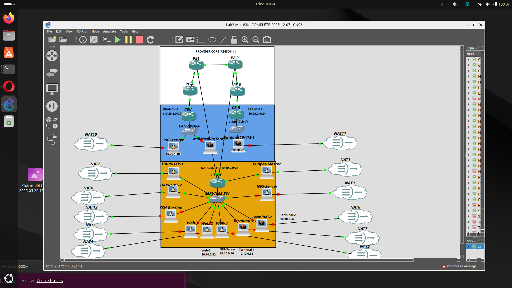

# Architecture - Lab 3 Multi-Site Enterprise Network

## Network Topology

## Overview

Multi-site enterprise network with one datacenter (DC) and two branch offices (A/B), connected via eBGP through a service provider.

## Sites

| Site | Router | AS | Connection | VRFs |
|------|--------|-----|------------|------|
| Datacenter | CE-DC | 65000 | Dual-homed (PE1+PE-2) | MGMT, SERVICES, USER |
| Branch A | CE-A | 65000 | Single-homed (PE-A) | MGMT, USER |
| Branch B | CE-B | 65000 | Single-homed (PE-B) | MGMT, USER |

## Network Addressing

| Site | MGMT | SERVICES | USER | WAN |
|------|------|----------|------|-----|
| DC | 10.0.0.0/24 | 10.10.0.0/24 | 10.20.0.0/24 | 192.168.100.0/30, .4/30 |
| Branch A | 10.0.1.0/24 | - | 10.20.1.0/24 | 192.168.101.0/30 |
| Branch B | 10.0.2.0/24 | - | 10.20.2.0/24 | 192.168.102.0/30 |

## BGP Design

### AS Numbers
- **Enterprise**: AS65000 (CE-DC, CE-A, CE-B)
- **Provider**: AS65001 (PE1, PE-2, PE-A, PE-B)

### Security Features
- Prefix-lists on all eBGP sessions
- Max-prefix limits (50 on CE, 10-20 on PE)
- BFD for fast failover (300ms intervals)
- Communities for traffic engineering

## Services (DC - 10.10.0.0/24)

| Service | IP | Description |
|---------|-----|-------------|
| HAProxy VIP | 10.10.0.9 | Load balancer virtual IP |
| HAProxy-1/2 | 10.10.0.10-11 | VRRP Master/Backup |
| Web-1/2/3 | 10.10.0.21-23 | Apache web servers |
| Terminal-1/2 | 10.10.0.31-32 | XRDP servers |
| NFS-Server | 10.10.0.40 | Shared storage |
| SSH-Bastion | 10.10.0.50 | MFA SSH gateway |

## Observability

| Feature | Protocol | Destination |
|---------|----------|-------------|
| SNMPv3 | UDP 161 | Polling from MGMT |
| Syslog | UDP 514 | Puppet-Master (10.0.0.10) |
| NetFlow v9 | UDP 2055 | HAProxy-1 (10.10.0.10) |

## Automation

- **Puppet**: Configuration management (12 hosts in Foreman)
- **PXE Boot**: Automated Debian installation (Branch A)
